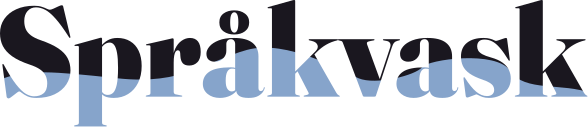

<div align="center">

<picture>
  <source media="(prefers-color-scheme: dark)" srcset="assets/logo.svg">
  
</picture>

**Norsk språkvask etter Språkrådets normer – for Claude Code, Cursor, Copilot, Codex og resten**

[](https://www.npmjs.com/package/sprakvask)
[](LICENSE)

</div>

---

# Språkvask

Norsk tekst som ser ut som den er skrevet av en som kan norsk.

En **skill** for Claude Code – og et vanlig sett med regler for enhver kodeagent
som skriver norsk. Den koder **Språkrådets** normer for rettskriving,
tegnsetting og klarspråk, og legger til det normene ikke dekker: hva som
avslører at en norsk tekst er tenkt på engelsk.

> **In English:** a Norwegian language skill for Claude Code and other coding
> agents. It encodes the orthography, punctuation and plain-language norms
> published by Språkrådet (the Language Council of Norway), and catches the
> tells of Norwegian written by someone thinking in English. Works for both
> written standards, bokmål and nynorsk.

```
✗  Vennligst fyll ut ditt navn — vi sender deg en bekreftelse.
✓  Fyll ut navnet ditt – vi sender deg en bekreftelse.
```

Tre feil i én linje: `vennligst` er `please` i norsk drakt, `ditt navn` er
engelsk ordstilling, og em-streken finnes ikke i norsk.

## Installer

```bash
npx sprakvask
```

Den finner ut hvilke agenter prosjektet allerede bruker og skriver reglene dit
de leter. Er det ingen å gå etter, lander de i `AGENTS.md`.

```bash
npx sprakvask --all       # alle støttede
npx sprakvask cursor      # bare én
npx sprakvask --global    # Claude Code, for alle prosjekter
npx sprakvask --list      # hva som støttes
npx sprakvask --remove    # angre
```

Start agenten på nytt etterpå.

### Hvor den skriver

| Agent | Fil |
| --- | --- |
| Claude Code | `.claude/skills/sprakvask/` |
| Codex, Jules, Factory, Amp | `AGENTS.md` |
| Cursor | `.cursor/rules/sprakvask.mdc` |
| Windsurf | `.windsurf/rules/sprakvask.md` |
| GitHub Copilot | `.github/copilot-instructions.md` |
| Cline | `.clinerules/sprakvask.md` |
| Zed | `.rules` |
| Aider | `CONVENTIONS.md` |

Det finnes ingen felles standard for dette. Innholdet er den samme prosaen
uansett – bare stien og frontmatteren skiller. Claude Code får hele ferdigheten
med referansefiler; de andre leser én fil, så de får sjekkene, med lenker til
resten.

Filene flere deler på – `AGENTS.md`, `copilot-instructions.md`, `.rules`,
`CONVENTIONS.md` – tilhører deg. Der skrives det inn et avmerket avsnitt som
kan oppdateres og fjernes igjen uten at noe annet i fila røres.

Som plugin i Claude Code, hvis du heller vil ha den slik:

```
/plugin marketplace add sivert-io/sprakvask
```

## Hva den gjør

Den slår inn når teksten er norsk – i grensesnitt, e-poster, dokumentasjon,
commit-meldinger, vilkår. Den rører ikke kode: `wantsFutureInvitations` blir
ikke `ønskerFramtidigeInvitasjoner`.

Tretten sjekker ligger i selve ferdigheten og dekker det meste. Detaljene
ligger i `references/` og lastes bare ved tvil:

| Fil | Innhold |
| --- | --- |
| `tegnsetting.md` | Komma, punktum, kolon, tankestrek, anførselstegn, apostrof, punktlister |
| `stor-liten-forbokstav.md` | Overskrifter, titler, institusjoner, du/De, merkenavn |
| `tall-datoer.md` | Tall, beløp, prosent, datoer, klokkeslett, frister, telefonnumre |
| `forkortelser.md` | Punktum eller ikke, vanlige feil, de vanligste forkortelsene |
| `ordvalg.md` | Særskriving, og/å, da/når, de/dem, forvekslinger, faste uttrykk, preposisjoner |
| `grammatikk.md` | Bøyning, samsvar, partisipp, verb, pronomen, konsekvens |
| `e-post-og-brev.md` | Hilsener, signatur, emnefelt, høflighet |
| `klarspraak.md` | Setningsbygning, passiv, substantivsyke, stive ord, digitale tjenester |
| `engelsk-smitte.md` | Oversatte vendinger, lånte betydninger, norske avløserord |
| `ki-markorer.md` | Oppblåste ord, tomme fraser og mønstre som avslører KI-tekst |
| `teksttyper.md` | Grensesnitt, dokumentasjon, README, commit, PR, versjonsmerknader, fagspråk |
| `ord-om-mennesker.md` | Kjønn, hudfarge, alder – ord som kan såre |
| `nynorsk.md` | Konsekvent nynorsk, passiv, vanlige feil, ordval |

## De vanligste feilene

| | Feil | Riktig |
| --- | --- | --- |
| Em-strek | `mat — drikke` | `mat – drikke` |
| Oxford-komma | `mat, drikke, og premier` | `mat, drikke og premier` |
| Særskriving | `lørdags kvelden` | `lørdagskvelden` |
| Anførselstegn | `"hei"` | `«hei»` |
| Tusenskille | `1,000` | `1 000` |
| Overskrifter | `Meld Deg På` | `Meld deg på` |
| Eiendomsform | `Sivert's bil` | `Siverts bil` |
| Høflighet | `Vennligst prøv igjen` | `Prøv igjen` |
| Eiendomsord | `din konto` | `kontoen din` |
| Komma | `For å melde deg på, må du …` | `For å melde deg på må du …` |
| E-post | `Hei Anna,` | `Hei, Anna` |
| Titler | `Daglig Leder` | `daglig leder` |
| Forkortelser | `evt.`, `ifht.`, `mnd.` | `ev.`, `ift.`, `md.` |
| Anglisisme | `når det kommer til` | `når det gjelder` |
| KI-preg | `Det er verdt å merke seg at …` | stryk, begynn med poenget |

## Kilder og forbehold

Normene er hentet fra [Språkrådet](https://sprakradet.no) – veiledningssidene
om korrekt språk, [klarspråkssidene](https://sprakradet.no/klarsprak/) og alle
de 1 122 svarene i spørsmål-og-svar-basen – og formulert med egne ord og
eksempler. Kapitlet om KI-preg bygger på Språkrådets test av ChatGPT,
[«KI-språkets fallgruver»](https://sprakradet.no/aktuelt/ki-sprakets-fallgruver/).
Ideen til kapitlene om KI-preg og teksttyper kommer fra tekstforfatter-skillen i
[Altinn Studio-dokumentasjonen](https://github.com/Altinn/altinn-studio-docs).
Ordformer og bøyning slår du opp i [Ordbøkene](https://ordbokene.no).

Dette er en sammenfatning laget av andre. Den er **ikke** utgitt av, tilknyttet
eller godkjent av Språkrådet, og den erstatter ikke å slå opp når du er i tvil.
Finner du en regel som er gjengitt feil, er en issue eller en pull request
velkommen.

## Lisens

MIT. Se [LICENSE](LICENSE).
