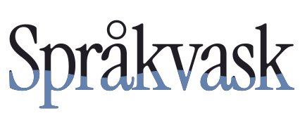

<div align="center">

<picture>
  <source media="(prefers-color-scheme: dark)" srcset="site/public/assets/logo.svg">
  
</picture>

**Norsk språkvask etter Språkrådets normer – for kodeagenter**

[](https://www.npmjs.com/package/sprakvask)
[](LICENSE)

</div>

---

# Språkvask

Norsk tekst som ser ut som den er skrevet av en som kan norsk.

Språkvask er et sett med norske språkregler for kodeagenter. Det bygger på
**Språkrådets** normer for rettskriving, tegnsetting og klarspråk, og legger
til det normene ikke dekker: hva som avslører at en norsk tekst er tenkt på
engelsk.

Installasjonen tilpasser reglene til agenten du bruker – blant annet Codex,
Cursor, Claude Code, Copilot og Windsurf.

> **In English:** Norwegian language rules for AI coding agents. Språkvask
> encodes the orthography, punctuation and plain-language norms published by
> Språkrådet (the Language Council of Norway), and catches the tells of
> Norwegian written by someone thinking in English. It supports multiple coding
> agents and works for both written standards, bokmål and nynorsk.

```
✗  Vennligst fyll ut ditt navn — vi sender deg en bekreftelse.
✓  Fyll ut navnet ditt – vi sender deg en bekreftelse.
```

Tre feil i én linje: `vennligst` er `please` i norsk drakt, `ditt navn` er
engelsk ordstilling, og em-streken finnes ikke i norsk.

## Installer

```bash
npx sprakvask
```

Den finner ut hvilke agenter prosjektet allerede bruker. Så skriver den reglene
dit de agentene leter. Er det ingen å gå etter, lander de i `AGENTS.md`.

```bash
npx sprakvask --all       # alle støttede
npx sprakvask cursor      # bare én
npx sprakvask --global    # Claude Code, for alle prosjekter
npx sprakvask --list      # hva som støttes
npx sprakvask --remove    # angre
```

Start agenten på nytt etterpå.

### Hvor den skriver

| Agent                      | Fil                               |
| -------------------------- | --------------------------------- |
| Claude Code                | `.claude/skills/sprakvask/`       |
| Codex, Jules, Factory, Amp | `AGENTS.md`                       |
| Cursor                     | `.cursor/rules/sprakvask.mdc`     |
| Windsurf                   | `.windsurf/rules/sprakvask.md`    |
| GitHub Copilot             | `.github/copilot-instructions.md` |
| Cline                      | `.clinerules/sprakvask.md`        |
| Zed                        | `.rules`                          |
| Aider                      | `CONVENTIONS.md`                  |

Det finnes ingen felles standard for dette. Innholdet er den samme prosaen
uansett – bare stien og frontmatteren skiller. Claude Code får hele ferdigheten
med referansefiler; de andre leser én fil, så de får sjekkene, med lenker til
resten.

Filene flere deler på – `AGENTS.md`, `copilot-instructions.md`, `.rules`,
`CONVENTIONS.md` – tilhører deg. Der skrives det inn et avmerket avsnitt som
kan oppdateres og fjernes igjen uten at noe annet i filen røres.

Som plugin i Claude Code, hvis du heller vil ha den slik:

```
/plugin marketplace add sivert-io/sprakvask
```

## Hva den gjør

Den slår inn når teksten er norsk – i grensesnitt, e-poster, dokumentasjon,
commit-meldinger, vilkår. Den rører ikke kode: `wantsFutureInvitations` blir
ikke `ønskerFramtidigeInvitasjoner`.

Tretten sjekker ligger i selve ferdigheten og dekker det meste. Detaljene
ligger i `references/` og lastes bare ved tvil:

| Fil                        | Innhold                                                                        |
| -------------------------- | ------------------------------------------------------------------------------ |
| `tegnsetting.md`           | Komma, punktum, kolon, tankestrek, anførselstegn, apostrof, punktlister        |
| `stor-liten-forbokstav.md` | Overskrifter, titler, institusjoner, du/De, merkenavn                          |
| `tall-datoer.md`           | Tall, beløp, prosent, datoer, klokkeslett, frister, telefonnumre               |
| `forkortelser.md`          | Punktum eller ikke, vanlige feil, de vanligste forkortelsene                   |
| `ordvalg.md`               | Særskriving, og/å, da/når, de/dem, forvekslinger, faste uttrykk, preposisjoner |
| `grammatikk.md`            | Bøyning, samsvar, partisipp, verb, pronomen, konsekvens                        |
| `e-post-og-brev.md`        | Hilsener, signatur, emnefelt, høflighet                                        |
| `klarspraak.md`            | Setningsbygning, passiv, substantivsyke, stive ord, digitale tjenester         |
| `engelsk-smitte.md`        | Oversatte vendinger, lånte betydninger, norske avløserord                      |
| `ki-markorer.md`           | Oppblåste ord, tomme fraser og mønstre som avslører KI-tekst                   |
| `teksttyper.md`            | Grensesnitt, dokumentasjon, README, commit, PR, versjonsmerknader, fagspråk    |
| `ord-om-mennesker.md`      | Kjønn, hudfarge, alder – ord som kan såre                                      |
| `nynorsk.md`               | Konsekvent nynorsk, passiv, vanlige feil, ordvalg                              |

## De vanligste feilene

|               | Feil                            | Riktig                       |
| ------------- | ------------------------------- | ---------------------------- |
| Em-strek      | `mat — drikke`                  | `mat – drikke`               |
| Oxford-komma  | `mat, drikke, og premier`       | `mat, drikke og premier`     |
| Særskriving   | `lørdags kvelden`               | `lørdagskvelden`             |
| Anførselstegn | `"hei"`                         | `«hei»`                      |
| Tusenskille   | `1,000`                         | `1 000`                      |
| Overskrifter  | `Meld Deg På`                   | `Meld deg på`                |
| Eiendomsform  | `Sivert's bil`                  | `Siverts bil`                |
| Høflighet     | `Vennligst prøv igjen`          | `Prøv igjen`                 |
| Eiendomsord   | `din konto`                     | `kontoen din`                |
| Komma         | `For å melde deg på, må du …`   | `For å melde deg på må du …` |
| E-post        | `Hei Anna,`                     | `Hei, Anna`                  |
| Titler        | `Daglig Leder`                  | `daglig leder`               |
| Forkortelser  | `evt.`, `ifht.`, `mnd.`         | `ev.`, `ift.`, `md.`         |
| Anglisisme    | `når det kommer til`            | `når det gjelder`            |
| KI-preg       | `Det er verdt å merke seg at …` | stryk, begynn med poenget    |

## Eksempler

Typiske tekster fra kodeagenter, før og etter språkvask. Trykk for å se.

<details>
<summary><strong>Feilmelding i et skjema</strong></summary>

```diff
- Vennligst fyll ut alle påkrevde felter. En feil oppstod — prøv igjen senere.
+ Fyll ut navn og e-post. Vi fikk ikke lagret påmeldingen, så prøv en gang til.
```

- `Vennligst` er engelsk `please` og virker stivt. Høfligheten ligger i setningen.
- `En feil oppstod` sier ikke hva som gikk galt eller hva leseren skal gjøre.
- Em-streken (`—`) finnes ikke i norsk.

</details>

<details>
<summary><strong>Knapper og overskrifter</strong></summary>

```diff
- Meld Deg På Nå
- Lagre Dine Innstillinger
+ Meld deg på nå
+ Lagre innstillingene
```

- Norsk har stor forbokstav bare i første ord og i egennavn.
- Eiendomsordet står etter substantivet: `innstillingene dine`. På en knapp holder det med `innstillingene`.

</details>

<details>
<summary><strong>E-post</strong></summary>

```diff
- Hei Kari,
-
- Takk for å melde deg på! Arrangementet vil finne sted Lørdag 16/10 kl 18:00-23:00.
-
- Mvh,
- Ola Nordmann
- Daglig Leder
+ Hei, Kari
+
+ Takk for at du meldte deg på! Vi ses lørdag 16. oktober kl. 18.00–23.00.
+
+ Vennlig hilsen
+ Ola Nordmann
+ daglig leder
```

- Komma står foran navnet i hilsenen, ikke etter.
- `Takk for å melde deg på` og `vil finne sted` er oversatt engelsk.
- Ukedager, måneder og titler har liten forbokstav.
- Datoer har punktum, ikke skråstrek. Tidsrom har tankestrek uten mellomrom.
- Avslutningen har ingen komma, og `Mvh.` frarådes i formelle e-poster.

</details>

<details>
<summary><strong>Priser, tall og frister</strong></summary>

```diff
- Billetten koster kr. 1,250.50 og må betales innen 1. oktober. 25% rabatt for medlemmer.
+ Billetten koster 1 250,50 kroner. Betal seinest 1. oktober. Medlemmer får 25 % rabatt.
```

- Tusenskille er mellomrom og desimalskille er komma. `kr` har ikke punktum.
- `innen 1. oktober` er tvetydig: mange leser det som «før 1. oktober».
- Prosenttegnet har mellomrom foran.

</details>

<details>
<summary><strong>Komma</strong></summary>

```diff
- For å fortsette, må du logge inn. Deltakere, som ikke har betalt mister plassen.
+ For å fortsette må du logge inn. Deltakere som ikke har betalt, mister plassen.
```

- Ikke komma etter et innledende uttrykk uten eget verb.
- En nødvendig relativsetning får komma etter, men ikke foran.

</details>

<details>
<summary><strong>README skrevet av en språkmodell</strong></summary>

```diff
- Det er verdt å merke seg at dette verktøyet tilbyr en sømløs og robust løsning
- som adresserer behovet for effektiv håndtering av data. Når det kommer til
- ytelse, spiller caching en avgjørende rolle.
+ Verktøyet leser CSV-filer og lagrer dem i PostgreSQL. Resultatene caches, så
+ samme spørring tar under et millisekund neste gang.
```

- Tomme innledninger og oppblåste ord (`sømløs`, `robust`, `avgjørende rolle`) sier ingenting konkret.
- `adressere et problem` og `når det kommer til` er oversatt engelsk.
- Etablerte fagord som `caches` står i tekst til utviklere.

</details>

<details>
<summary><strong>Særskriving og apostrof</strong></summary>

```diff
- Skriv inn bruker navn og passord for å se Sivert's påmeldings skjema.
+ Skriv inn brukernavn og passord for å se påmeldingsskjemaet til Sivert.
```

- Sammensatte ord skrives i ett ord.
- Eiendomsform har ikke apostrof: `Siverts`. Ofte leses `skjemaet til Sivert` lettere.

</details>

<details>
<summary><strong>Nynorsk</strong></summary>

```diff
- Søknaden behandlast i mai. Ta kontakt hvis det finnast feil i opplysningane.
+ Søknaden blir behandla i mai. Ta kontakt dersom det finst feil i opplysningane.
```

- Nynorsk har ikke s-passiv i presens: `blir behandla`, ikke `behandlast`.
- `hvis` finnes ikke i nynorsk. `det finst` er riktig presens av `finnast`.

</details>

## Kilder og forbehold

Normene er hentet fra [Språkrådet](https://sprakradet.no) – veiledningssidene
om korrekt språk, [klarspråkssidene](https://sprakradet.no/klarsprak/) og alle
de 1 122 svarene i spørsmål-og-svar-basen – og formulert med egne ord og
eksempler. Kapitlet om KI-preg bygger på Språkrådets test av ChatGPT,
[«KI-språkets fallgruver»](https://sprakradet.no/aktuelt/ki-sprakets-fallgruver/).
Ideen til kapitlene om KI-preg og teksttyper kommer fra tekstforfatter-skillen i
[Altinn Studio-dokumentasjonen](https://github.com/Altinn/altinn-studio-docs).
Ordformer og bøyning slår du opp i [Ordbøkene](https://ordbokene.no).

Dette er en sammenfatning laget av andre. Den er **ikke** utgitt av, tilknyttet
eller godkjent av Språkrådet, og den erstatter ikke å slå opp når du er i tvil.
Finner du en regel som er gjengitt feil, er en issue eller en pull request
velkommen.

## Lisens

MIT. Se [LICENSE](LICENSE).
